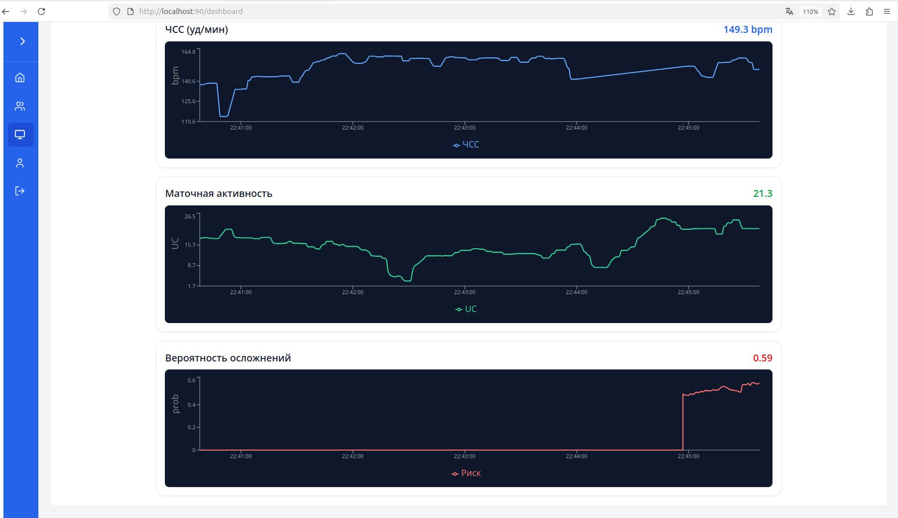
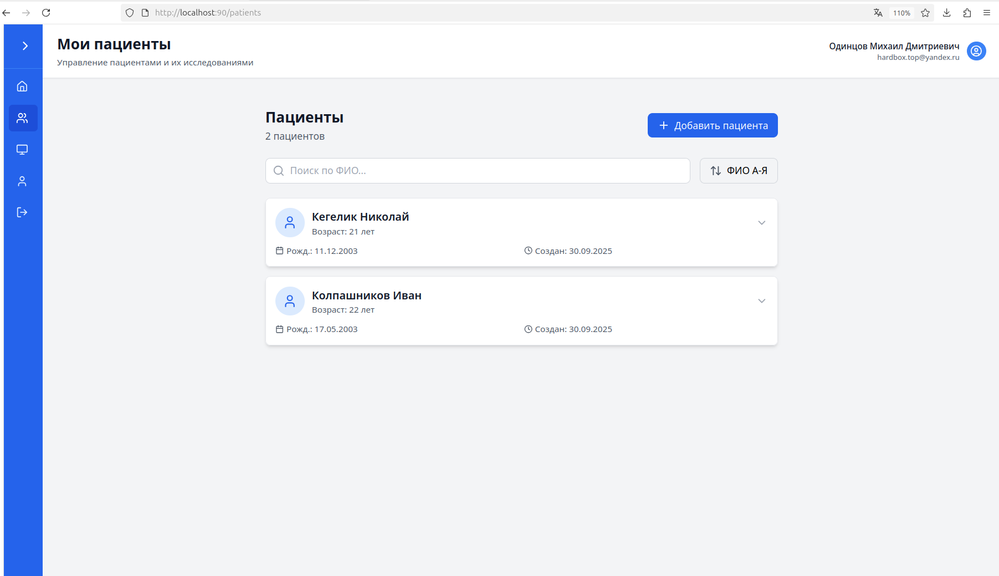
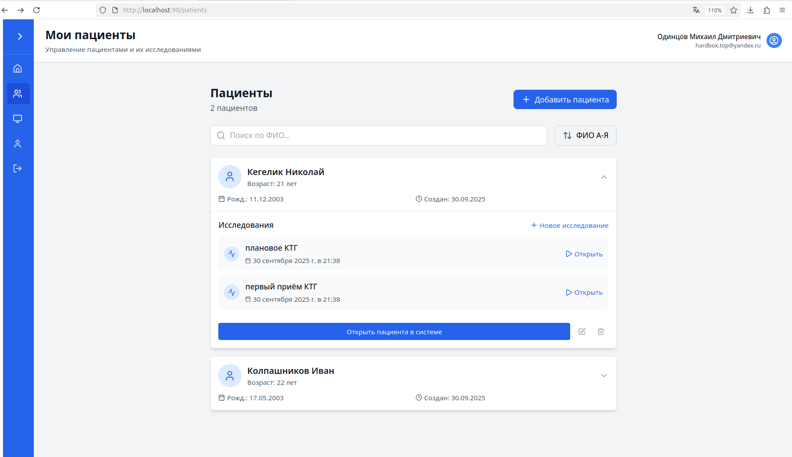
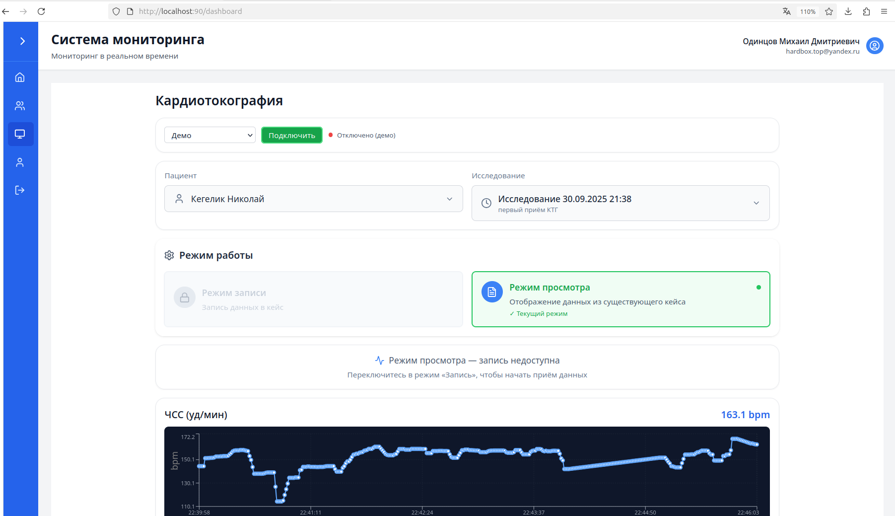
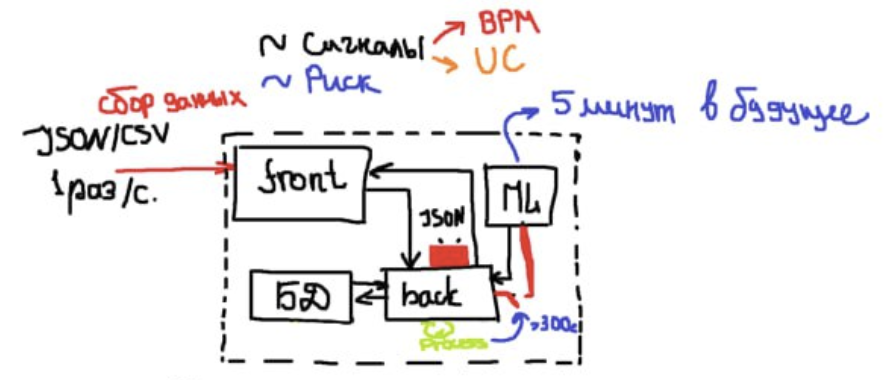

# Система потокового анализа КТГ и раннего риска гипоксии

## Зачем это нужно

КТГ даёт врачу много шума и фрагментов сигнала, которые трудно интерпретировать «на лету». Наша система превращает непрерывный поток (ЧСС плода и маточная активность) в понятную динамическую оценку риска на ближайшие минуты — так, чтобы врач мог вовремя отреагировать, а не разбираться постфактум.

## Что делает система в одном предложении

Каждую секунду система анализирует последние 5 минут КТГ и прогнозирует риск на следующие 5 минут, показывая врачу плавную кривую вероятности, события КТГ и аккуратно управляемую тревогу.

## Кому это полезно

* Акушерские отделения и перинатальные центры.
* Команды, внедряющие цифровой мониторинг в родзалах и на ДО.
* Исследовательские группы, которым нужна прозрачная, воспроизводимая методика онлайн-оценки КТГ.

## Как это помогает клинике

* **Вовремя предупредить.** Прогноз на 5 минут вперёд даёт «фору» для действий.
* **Меньше ложных тревог.** Порог и гистерезис снижают «мигание» сигнализации.
* **Пояснимо.** Признаки опираются на привычные врачам события КТГ (децелерации, вариабельность, связь с сокращениями).

## В чём новизна подхода

* **Потоковая каузальная логика.** Никаких «подглядываний в будущее»: оцениваем только то, что реально уже произошло.
* **Окна вместо “средней по больнице”.** Классифицируем короткие окна истории и обновляем прогноз каждую секунду — это сохраняет клинический смысл непрерывного мониторинга.
* **Суррогатная разметка по правилам FIGO.** Даёт быструю и прозрачную основу для обучения без ручной разметки всей записи.

---
## ML-подход

### Что именно прогнозируем

* **Вход:** последние **5 минут** КТГ (ЧСС плода — FHR и маточная активность — UC).
* **Выход:** вероятность риска на **следующие 5 минут**.
* **Режим:** обновление оценки **каждую секунду** из кольцевого буфера 300 с. Никакого «заглядывания в будущее».

### Почему окна, а не «вся запись»

Непрерывный мониторинг требует решений **здесь и сейчас**. Короткие каузальные окна сохраняют клинический смысл потока: модель реагирует на текущую динамику и даёт краткосрочный прогноз, пригодный для действий.

### Разметка: правила FIGO как «суррогатный учитель»

Чтобы не ждать длительной ручной разметки, используем формализованные **критерии FIGO** для получения прозрачной, воспроизводимой метки на окно:

* **Децелерации:** выявляем эпизоды снижения FHR; учитываем **глубину** и **длительность**, различаем **ранние**, **поздние**, **вариабельные**, выделяем **пролонгированные**.
* **Акцелерации:** кратковременные подъёмы ЧСС.
* **Вариабельность:** классифицируем участки **низкой** и **нормальной** вариабельности по типичным амплитудам/длительностям.
* **Тахикардия/бради-кардиЯ:** устойчивые смещения базового уровня вверх/вниз.
* **Маточная активность (UC):** пики, их ширина/проминентность и **связь по времени** с децелерациями.
  Правила применяются **строго внутри окна истории**, формируя метку (суррогатный таргет), пригодную для обучения.

### Признаковое описание

Сочетаем «понимаемую физиологию» и устойчивую статистику:

* **Статистические:** базовый уровень FHR, разброс, кратко- и долгопериодная вариабельность, тренды, устойчивые агрегаты (медианы/квантили).
* **Частотные:** относительные мощности в низких/высоких диапазонах, спектральные отношения, меры «регулярности» (энтропийные).
* **Событийные (FIGO-логика):** счётчики и суммарные характеристики децелераций/акцелераций, доля времени с низкой вариабельностью, параметры UC-пиков и **их временная привязка** к событиям FHR.
* **Шумо-стойкость:** мягкие сглаживания, защита от выбросов; всё настроено так, чтобы **не терять реактивность** в реальном времени.

### Модель и обучение

* Базовый классификатор: **CatBoostClassifier** — стабилен к разномасштабным признакам, даёт адекватные вероятности и интерпретируемые важности.
* **Честная валидация по пациентам** (GroupKFold/GroupShuffleSplit), чтобы исключить утечку индивидуальной физиологии между train/val/test.
* Основные метрики: **PR-AUC и F1** (баланс «находим риск / не шумим»), дополнительно ROC-AUC.

### Результаты (консервативная оценка)

* На независимых пациентах: **ROC-AUC ≈ 0.78**, **F1 ≈ 0.75** при пороге ~**0.44**.
* Локально на валидации встречались запуски до **~0.82 ROC-AUC**, но фиксируем **консервативный** уровень переносимости — ~0.73.
* Вероятности калиброваны; при необходимости поверх применяется изотоническая калибровка.

### Постобработка для тревоги

* Для сигнализации — **гистерезис** (включаем при устойчиво высоких значениях, выключаем при устойчиво низких), что заметно снижает «мигание» без потери чувствительности на интервалах в минуты.

### Почему это работает в потоке

* **Каузальность:** признаки считаются только из доступной истории.
* **Ежесекундное обновление:** кривая риска плавная, врач видит динамику, а не ступеньки.
* **Событийные признаки:** объяснимость «на языке врача» — видно, какие паттерны поднимают риск.

### Ограничения и развитие

* Качество зависит от чистоты сигнала; тяжёлые артефакты временно снижают доверие.
* На редких паттернах возможен дрейф калибровки — решается дообучением и таргетной регуляризацией.
* Планируем **сравнительный бенчмарк нейросетей** (RNN/Transformer) при сохранении событийной объяснимости и строгой групповой валидации.

---

## Бекенд

### Роль бекенда в системе

Бекенд — это «режиссёр» потока: принимает данные КТГ от датчиков, поддерживает кольцевой буфер 5-минутной истории, вызывает ML-сервис для прогноза на следующие 5 минут и отдаёт фронтенду всё в удобном, стабильном формате. Никаких тяжёлых зависимостей, строгая каузальность, минимум задержек.

### Универсальные сценарии развёртывания

1. **Облако/дата-центр**

   * Разворачиваем бекенд на удалённом сервере.
   * Врачи подключаются по защищённой ссылке из локальной сети учреждения или через VPN.
   * **Датчики — максимально простые:** только запись и отправка (HTTP/WebSocket). Это удешевляет оборудование, а «умная» часть живёт на сервере.

2. **Edge-вариант (устройства с «мозгами»)**

   * Используем тот же бекенд, собранный в лёгкий контейнер, прямо на устройстве/шлюзе рядом с датчиком.
   * Локальная обработка → устойчивость к сетевым сбоям, мгновенная визуализация на ближайшем терминале.
   * При появлении связи результаты могут синхронизироваться с центральным сервером.

Обе схемы используют один и тот же код и протоколы — переносимость без «раздвоения» проекта.

### Почему он лёгкий и дешевый в эксплуатации

* **Минимальные зависимости:** чистый FastAPI, стандартные библиотеки Python, только необходимое для общения с ML-сервисом и фронтом.
* **Лёгкие контейнеры:** базовые slim-образы (Linux + Python) без лишнего — быстро стартуют, мало едят RAM/CPU.
* **Горизонтальная масштабируемость:** несколько инстансов за Nginx/балансировщиком; статeless-логика обработки потока (история хранится в оперативной памяти, а устойчивое хранение — в БД, которую опишем отдельно).
* **Низкая латентность:** кольцевой буфер в памяти, асинхронные вызовы ML, быстрые ответы фронтенду.

добавляю раздел в блок «Бекенд» про работу с БД: ORM-доступ и режимы async/sync — кратко и по делу.

### Взаимодействие с БД: ORM, async и sync

#### Зачем два режима

* **Async (основной путь в онлайне):** эндпоинты приёма потока и выдачи данных работают на ASGI, поэтому используем **асинхронный ORM-драйвер** (SQLAlchemy 2.x + asyncpg). Это удерживает низкую латентность при сотнях одновременных подключений: вставки точек 1 Гц, чтение «хвоста» 5 минут, запись предсказаний каждую секунду.
* **Sync (утилиты и офлайн-джобы):** фоновые скрипты, миграции, бэкапы, разовые перерасчёты окон/фич удобнее держать в **синхронном ORM-режиме** (тот же SQLAlchemy, sync-engine). Он предсказуем в CLI/cron и не блокирует ASGI-воркеров.

#### Как это устроено логически

* **Единые модели ORM.** Определения сущностей одни и те же; меняется только тип движка/сессии (async vs sync).
* **Unit of Work (транзакции короткие):** каждую секунду — одна транзакция на пакет: принять сырые точки → (опционально) записать окно/предсказание → зафиксировать. Максимально короткие транзакционные границы снижают конкуренцию.
* **Repository-слой:** узкие методы `save_points`, `load_tail(case_id, 300s)`, `save_prediction(...)`. Это дисциплинирует доступ и предотвращает «расползание» SQL по коду.
* **Буфер в памяти — первичен.** Последние 5 минут сигнала держим в кольцевом буфере, а БД — для долговременного хранения и аудита. Это резко уменьшает число чтений из БД в онлайне.


## База данных проекта 

### Назначение

База данных хранит:

* пользователей и их пациентов,
* «кейсы» наблюдений (сеансы потока),
* сырые точки сигнала 1 Гц (FHR/bpm и UC),
* результаты модели (вероятность, метка, тревога) по временным окнам.

Модель данных поддерживает потоковый режим: быстрые выборки последних секунд, однозначная привязка предсказаний к кейсу и моменту времени, возможность ретенции и партиционирования по мере роста.

### ER-схема

```
[User] 1 ─── ∞ [Patient] 1 ─── ∞ [Case] 1 ─── ∞ [RawSignal]
                                   └────────── ∞ [Prediction]
```

**User** — владелец записей (например, врач/аккаунт).
**Patient** — пациент, сгруппированный под владельца.
**Case** — конкретное наблюдение/сеанс, в рамках которого идёт поток КТГ.
**RawSignal** — сырые точки: момент времени, bpm, uc.
**Prediction** — результат ML по окну/тику: вероятность риска, бинарная метка, состояние тревоги.

### Сущности

#### users

* Поля: `id`, `email` (уникальный), `hashed_password`, `name`, `created_at`.
* Назначение: аутентификация/авторизация, связь с пациентами.

#### patients

* Поля: `id`, `name` (или псевдоним/код), `birth_date?`, `owner_id`, `created_at`.
* Назначение: контейнер клинических записей под конкретного пользователя.

#### cases

* Поля: `id`, `patient_id`, `description?`, `created_at`.
* Назначение: скоуп потоковой записи; все точки и предсказания относятся к конкретному `case`.

#### raw_signals

* Поля: `id`, `case_id`, `timestamp`, `bpm`, `uc`.
* Назначение: фактический поток данных 1 Гц (без агрегации).
* Ключевой доступ: «последние N секунд для case».

#### predictions

* Поля: `id`, `case_id`, `model_name`, `probability (0..1)`, `label (0/1)`, `alert (0/1)`, `created_at`.
* Назначение: слепки вывода модели; используются для визуализации и аудита.
* Рекомендуемое расширение: `t_ref` (время, к которому относится прогноз), `t_start/t_end` (границы окна), `horizon_s` (обычно 300).

### Индексы и ограничения

* `raw_signals`: BTREE **(case_id, timestamp)** — базовый индекс для быстрых «хвостов» потока.
* `predictions`: BTREE **(case_id, created_at)** — лента предсказаний и выбор «последнего».
* Уникальность предсказаний на момент (если используется `t_ref`): **UNIQUE (case_id, model_name, t_ref)**.
* CHECK-ограничения для гигиены данных:

  * `probability BETWEEN 0 AND 1`
  * `bpm BETWEEN 40 AND 240`
  * `uc  BETWEEN 0 AND 200`

### Типовые сценарии доступа

* Получить последние 5 минут сигнала для рендеринга: выборка по `(case_id, timestamp >= now()-300s)` с индексом.
* Построить график риска: выборка `predictions` по `(case_id, created_at >= now()-X)` с сортировкой по времени.
* Аудит: фильтрация по `case_id`, `model_name`, диапазону `created_at`/`t_ref`.

---

## Фронтенд

### Задача фронтенда

Интерфейс превращает шумный поток КТГ в ясную картину “здесь-и-сейчас”: графики FHR и UC, кривая риска на ближайшие 5 минут, видимые события (децелерации, низкая вариабельность и т.п.) и аккуратная тревога без «мигания». Всё работает в реальном времени и одинаково удобно на мониторе поста и на планшете в родзале.

---

### Ключевые экраны

#### 1) Онлайн-мониторинг (основной экран)

* Две ленты: **FHR (bpm)** и **UC**.
* Скользящее окно **последних 5 минут** + **кривая вероятности риска на 5 минут вперёд**.
* Метки событий (децелерации/акцелерации/низкая вариабельность/тахи/бради) и их всплывающие описания.
* Индикация тревоги с гистерезисом (вкл/выкл с причиной).

* 

---

#### 2) Карточка пациента/кейса

* Паспорт пациента (без избыточной PHI), список активных и завершённых **кейсов**.
* Для выбранного кейса: мини-графики последних 15 минут, текущий статус тревоги, время последнего пакета данных.


* 
* 

---

#### 3) История и разбор эпизодов

* Лента предсказаний и событий за выбранный период.
* Быстрые фильтры: «только децелерации», «низкая вариабельность», «пики UC».
* Экспорт скриншота/отчёта (для разбора смены).


* 

---

#### Особенности

* **Плавные графики:** обновление **каждую секунду**, при этом линии не «дёргаются» — используется буферизация и сглаживание только на уровне отрисовки, без искажения данных.
* **Порог на виду:** активный порог показывается на кривой риска.
* **Адаптивный интерфейс:** крупные шрифты и контраст для постов наблюдения; управление с клавиатуры и сенсора.
* **Состояния сети:** индикатор соединения (WS/SSE), «последний пакет: N сек назад», безопасный деградирующий режим при временных потерях связи.

---

#### Как фронтенд «дышит» данными

* **Реал-тайм канал:** WebSocket или Server-Sent Events от бекенда. Пакеты 1 Гц с `t, bpm, uc` + свежая вероятность риска.
* **Кольцевой буфер на клиенте:** хранит **ровно 300 секунд** истории для мгновенной перерисовки без перезапросов.
* **Лёгкие форматы:** компактный JSON; всё, что тяжелее (агрегации/история за день), подгружается по требованию.
* **Разумная частота перерендера:** UI обновляется 1–2 раза/с (визуально плавно, экономно к CPU/GPU).


## Docker и Nginx

### Зачем нам Docker

Docker даёт предсказуемую среду выполнения для всех частей системы — от ноутбука разработчика до сервера в клинике или edge-устройства рядом с датчиком. Мы упаковываем каждый компонент в отдельный контейнер и получаем:

* **Изоляцию.** Библиотеки и зависимости одного сервиса не мешают другим.
* **Универсальные сценарии развертывания.**
  — Облако/сервер: тонкие клиенты-датчики отправляют данные на единый бэкенд.
  — Edge: тот же стек работает локально на шлюзе рядом с датчиком, устойчив к перебоям сети.
* **Экономию ресурсов.** Мы сознательно используем **минимальные базовые образы** и **минимальный набор зависимостей**, чтобы снизить потребление RAM/CPU и ускорить запуск.
* **Наблюдаемость и обслуживание.** Здоровье контейнеров проверяется простыми health-чеками, логи и метрики собираются единообразно.

**Что контейнеризовано:** фронтенд, бэкенд (API и поток), ML-сервис (инференс), вспомогательные задачи (симуляторы, воркеры). База данных описывается отдельно, но интегрируется в ту же схему запуска.




---

### Зачем нам Nginx

Nginx — “фасад” системы. Он стоит перед сервисами и решает сетевые задачи, чтобы сами приложения оставались лёгкими и простыми.

**Роли Nginx в проекте:**

* **Reverse-proxy и маршрутизация.** Прозрачно раздаёт фронтенд и проксирует запросы по путям (например, `/api` → бэкенд, `/ml` → ML-сервис). Это скрывает внутреннюю топологию и упрощает адресацию.
* **Терминация TLS.** Шифрование на входе, единая точка управления сертификатами и безопасными шифрами.
* **Поддержка real-time.** Корректное проксирование WebSocket/SSE для живых графиков и потока данных.
* **Производительность фронта.** Раздача статических файлов, HTTP/2, компрессия (gzip/br), кэширование — быстрые загрузки на рабочих местах и планшетах.
* **Надёжность и контроль трафика.** Лимиты на размер запроса, таймауты, защита от «болтливых» клиентов, базовые правила rate-limit.
* **Безопасность заголовков и CORS.** Централизованная политика, не размазанная по сервисам.
* **Наблюдаемость.** Единые access/error-логи, удобные для аудита, мониторинга задержек и поиска инцидентов.

### Важные нюансы

* Мы сознательно выбрали **лёгкие контейнеры** и **централизованный reverse-proxy**, чтобы система была дешёвой в эксплуатации, быстро обновлялась и одинаково работала в двух режимах: **серверном** и **edge**.
* Такая архитектура уменьшает риски: упростили безопасность (TLS и заголовки в одном месте), ускорили отклик (кэш и компрессия), а также сохранили **реальное время** для КТГ (корректный прокси для WebSocket/SSE).

---

## Дальнейшее развитие проекта


### 1) Качество модели и верификация

* Уточнить FIGO-правила и пороги на основе фидбэка врачей (тонкая настройка событий и гистерезиса).
* Калибровка вероятностей под отделение (изотоника/Platt на локальных данных).
* Абляции: включать/выключать группы признаков (событийные/частотные/статистические) и фиксировать влияние на PR-AUC/F1.

### 2) Данные

* Набор «эталонных» кейсов для регрессионных тестов и демонстраций (без чувствительных данных).

### 3) Эксплуатация и надёжность

* Нагрузочные тесты потока 1 Гц на нескольких параллельных кейсах.
* Полный путь наблюдаемости: логи + базовые дашборды (время от точки до предсказания).

### 4) Фронтенд и UX

* Режим «учебный»: подсказки по типам событий FIGO, «почему вырос риск».
* Улучшение доступности: крупные контрастные темы, горячие клавиши, тёмная/светлая тема.
* Экспорт экранов/эпизодов в отчёт (PDF/PNG) для разбора смен.

### 5) Интеграции и совместимость

* Импорт/экспорт в простых форматах (CSV/JSON) для исследований.
* Локальные «тонкие» датчики: схема простого протокола отправки `t,bpm,uc`.
* Edge-режим: упаковать текущий стек в лёгкий профиль для офлайн-работы с последующей синхронизацией.

---

## Документация для разработчиков

* **Developer Guide:** архитектура, эндпоинты, контракт `/predict`, форматы данных, запуск в dev/pilot.
  👉 [ссылка](./backend/README.md)
* **ML Guide:** вычисление признаков, FIGO-правила, валидация, выбор порога, калибровка.
  👉 [решение](./ml/notebooks/solution.ipynb), [документация](./ml/README.md)
* **Frontend Guide:**:
  👉 [ссылка](./frontend/README.md)
* **Ops/Deploy:** профили Docker, env-переменные, health-checks, обновления, мониторинг.
  👉 [ссылка](./docs/OPS_DEPLOY.md)

---

## О нас

Система создана для **Хакатона «Лидеры Цифровой Трансформации 2025» (Задача 3).**

**Команда №32 «Дядя Бао»**

Разработчики — студенты кафедры «Компьютерные медицинские системы» НИЯУ МИФИ.

## Наша команда — контакты

* **[Одинцов Михаил Дмитриевич](https://github.com/OdincovMD)**
* **[Кегелик Николай Александрович](https://github.com/Horokami)**
* **[Сухинин Виталий Максимович](https://github.com/LLLx0iq)**
