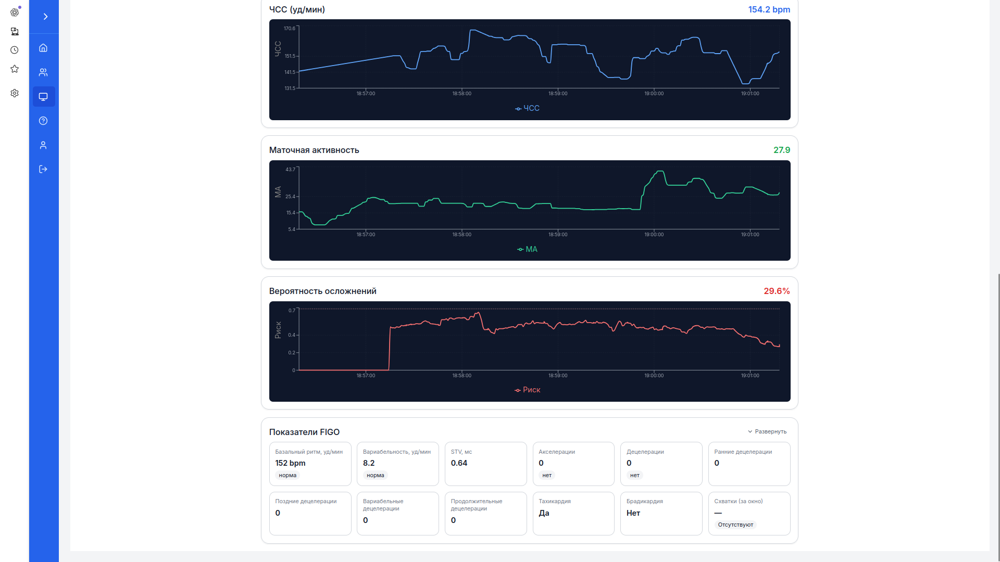
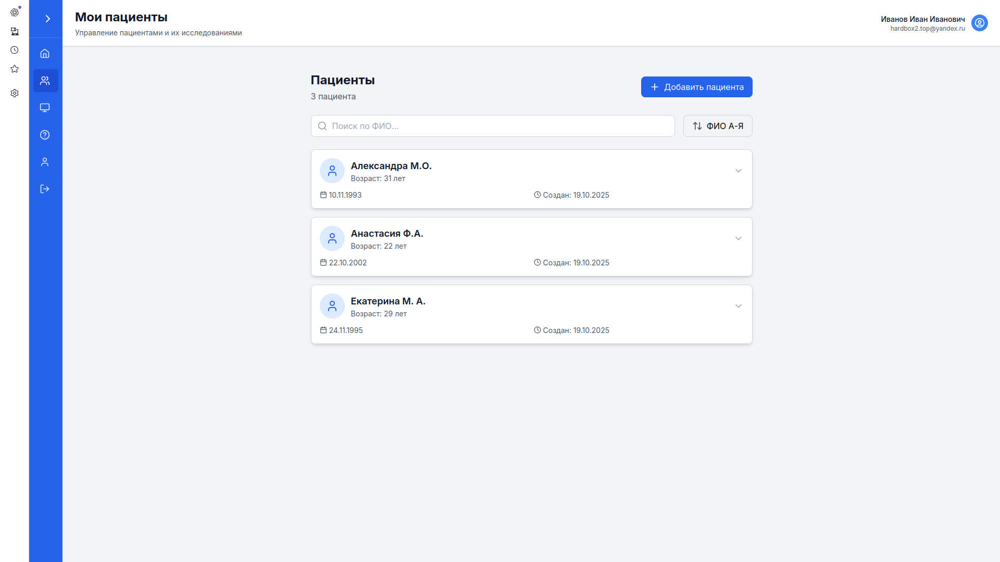
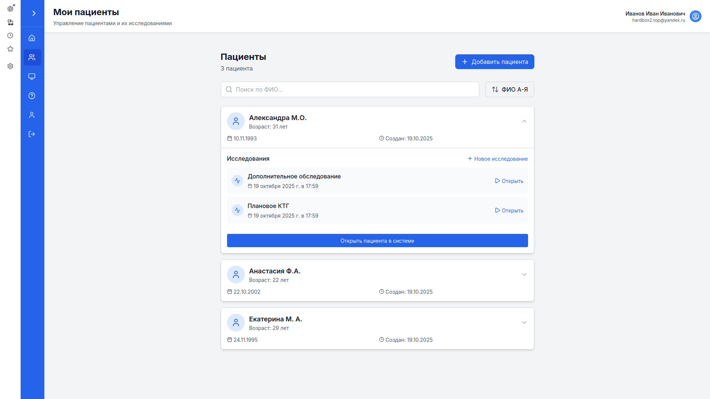
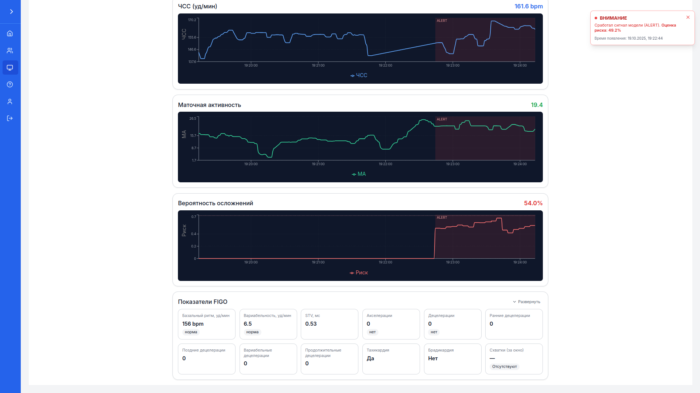
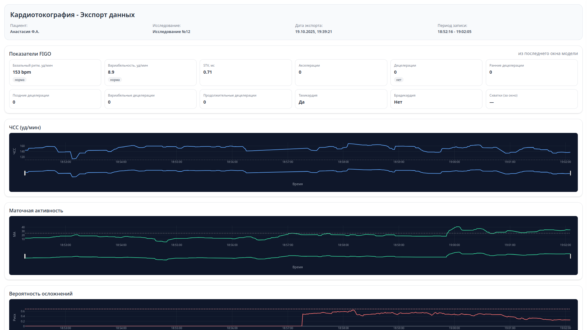
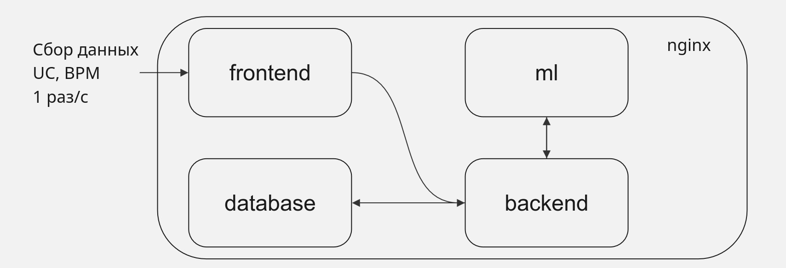

## Что нового мы сделали

1. **Параметры вынесены в интерфейс и протокол.**
   Теперь `H` (длина окна) и `stride` (шаг инференса) задаются **в UI** и автоматически пробрасываются в бекенд/модель. На графике видно активный порог и гистерезис тревоги; параметры учитываются при расчёте вероятности и ALARM‑состояния.

   * UI‑контролы для `H` и `stride`.
   * Передача параметров в WS‑URL (`&H=…&stride=…`) и в HTTP‑запросы.
   * Согласованность фронт ↔ бекенд ↔ ML при смене настроек «на лету».

2. **Три полноценных режима подключения датчиков.**
   Мы **добавили и WebSocket, и USB‑bridge, и Demo** — все дают идентичную «ленту» на фронтенде.

   * **WebSocket (live):** прямое подключение датчика к `ws://…/ws/case/<id>?token=<opaque>&H=…&stride=…`.
   * **USB‑мост:** для legacy‑оборудования без WS; выбор COM/tty‑порта, drop‑конфиг `bridge-<case_id>-<ts>.json`, публикация тех же `t,bpm,uc` в бекенд.
   * **Demo / загрузка файла:** эмулятор `csv_ws_publisher.py` и загрузка CSV из UI для офлайн‑разбора/презентаций.

3. **Параметры модели — на фронтенде.**
   Ключевые настройки и состояния модели **видны прямо на экране мониторинга** и в карточке кейса — врачу не нужно «угадывать», на каких параметрах считался риск.

  * Отображаются **ключевые признаки/события FIGO**, повлиявшие на решение (напр., «пролонгированная децелерация + низкая вариабельность»).
   * **Окно `H`** и **шаг инференса `stride`** показываются как бейджи над лентой (и меняются синхронно с UI‑контролами).

4. **Режим истории и скачивание лент.**
   Сохранённые кейсы открываются **как настоящая КТГ‑лента**: прокрутка, маркеры событий, показатели и кривая риска.

   * Экспорт **HTML‑отчёта** (с baseline, STV, LF/HF, счётчиками децелераций, долей низкой вариабельности, UC‑характеристиками) и **PNG‑скриншотов**.
   * Удобный шаринг: HTML открывается в браузере и воспроизводит «ленту».

5. **Деплой на сервер.**
   Проект развернут на прод‑домене **[https://ctg-ldt.ru](https://ctg-ldt.ru)** (Nginx → FastAPI/React) с HTTPS, корректным проксированием **WS/SSE** и оптимизированными заголовками.

6. **Большое обновление интерфейса и стабильности.**
   Убрали «мигание» графиков, улучшили подписи осей/сетки, исправили проблемы со слайдером/скроллом ленты и состояниями кнопок.

   * Перерисовка 1–2 Гц (плавно и экономно к CPU/GPU).
   * Поведение тревоги: порог + гистерезис, понятная причина срабатывания.
   * Карточка пациента/кейса: быстрый доступ к истории и скачиванию.

**Итог:** разработка полностью аналогична настоящим мониторам: непрерывная лента, привычные клинические показатели и FIGO‑логика, дополненные объяснимым ML‑риском и промышленным стримингом.

# Система потокового анализа КТГ и раннего риска гипоксии

## Зачем это нужно

КТГ даёт врачу много шума и фрагментов сигнала, которые трудно интерпретировать «на лету». Наша система превращает непрерывный поток (ЧСС плода и маточная активность) в понятную динамическую оценку риска на ближайшие минуты — так, чтобы врач мог вовремя отреагировать, а не разбираться постфактум.

При этом система полностью соответствует логике работы классического фетального монитора: врач в реальном времени видит знакомые графики ЧСС и маточной активности, а также ключевые показатели (baseline, вариабельность, ускорения/декелерации и др.), на основании которых модель формирует прогноз. Эти же показатели врач обычно оценивает «на глаз» по ленте — мы просто автоматизируем и стабилизируем расчёты, убирая субъективность и экономя время.

Как и в клинической практике, доступен «режим истории»: можно вернуться к любой записи, просмотреть ленту исследования, динамику показателей и эволюцию риска. Вся лента и сопутствующие графики сохраняются в системе в виде готовой HTML‑страницы, поэтому этой историей легко делиться с коллегами как «реальной лентой» — достаточно открыть ссылку или выгрузить файл.

## Кому это полезно

* Акушерские отделения и перинатальные центры.
* Команды, внедряющие цифровой мониторинг в родзалах и на ДО.
* Исследовательские группы, которым нужна прозрачная, воспроизводимая методика онлайн-оценки КТГ.

## Как это помогает клинике

* **Вовремя предупредить.** Прогноз не только на 5 минут: поддерживаем несколько горизонтов (например, 5–15 минут), настраиваемых из интерфейса. Шаг инференса также параметризуем, чтобы подбирать частоту обновления под клиническую ситуацию.
* **Клинически привычный монитор.** Интерфейс повторяет фетальный монитор: непрерывные ленты ЧСС/МА, маркеры событий и цифровые показатели (baseline, STV, LF/HF и др.). Врач работает в знакомой парадигме, а модель выполняет расчёты «под капотом».
* **Меньше ложных тревог.** Порог и гистерезис снижают «мигание» сигнализации и уменьшают утомляющие ложные срабатывания.
* **Пояснимо.** Признаки опираются на привычные врачам события КТГ (децелерации, вариабельность, связь с сокращениями), их значения и динамика видимы в интерфейсе.

## В чём новизна подхода

* **Потоковая каузальная логика.** Никаких «подглядываний в будущее»: оцениваем только то, что реально уже произошло.
* **Окна вместо “средней по больнице”.** Классифицируем короткие окна истории и обновляем прогноз каждую секунду — это сохраняет клинический смысл непрерывного мониторинга.
* **Суррогатная разметка по правилам FIGO.** Даёт быструю и прозрачную основу для обучения без ручной разметки всей записи.
* **Мульти-горизонтный прогноз.** Считаем риск на несколько горизонтов (например, 5/10/15 минут), чтобы врач видел «короткую» и «длинную» перспективу.
* **Гибкая частота инференса.** Шаг инференса (stride) настраивается из интерфейса и передаётся на бэкенд — баланс между чувствительностью и нагрузкой.
* **Пояснимость на уровне признаков.** Врач видит те же клинические признаки (baseline, STV, LF/HF, ускорения/декелерации, связь с UC), на которых работает модель: меньше «чёрного ящика» и больше доверия.
* **Гибрид правил FIGO и ML-модели.** Правила FIGO дают стабильную основу и «якорь» интерпретации, ML-модель (CatBoost) учит сложные зависимости и сглаживает шум.
* **Анти-дребезг тревог.** Порог, гистерезис и пост-обработка снижают «мигание» алертов при пограничных состояниях.
* **Промышленный стриминг.** Live-WS/SSE режимы, имитация датчика, запись в БД и «истинно реальное время» на фронтенде с минимальной задержкой.
* **Шаринг клинической ленты.** История сохраняется как HTML-страница и может быть передана коллеге как «реальная лента» с воспроизведением.
* **Портируемость и офлайн-режим.** Предусмотрен USB-мост для оборудования без WebSocket; деплой в Docker/Nginx, единые конфиги окружений.
* **Воспроизводимость.** Фиксированные окна, явные параметры H/stride, версионированные модели и пайплайны — одна и та же запись даёт одинаковый результат.

---
## ML-подход

### Что именно прогнозируем

* **Вход:** последние **H минут** КТГ (ЧСС плода — FHR и маточная активность — UC), по умолчанию **H = 5**. Окно каузальное.
* **Выход:** вероятность риска, плюс бинарный алерт по настраиваемому порогу с гистерезисом.
* **Режим:** обновление оценки **каждые `stride` секунд** (по умолчанию **1 с**) из кольцевого буфера `H·60` секунд. Никакого «заглядывания в будущее».

### Почему окна, а не «вся запись»

Непрерывный мониторинг требует решений **здесь и сейчас**. Короткие каузальные окна сохраняют клинический смысл потока: модель реагирует на текущую динамику и даёт краткосрочный прогноз, пригодный для действий.

### Разметка: правила FIGO как «суррогатный учитель»

Чтобы не ждать длительной ручной разметки, используем формализованные **критерии FIGO** для получения прозрачной, воспроизводимой метки на окно. Эти правила **понятны клиницистам** и соответствуют привычной практике чтения КТГ: врач видит знакомые события и логику принятия решений, а не «чёрный ящик».

* **Децелерации:** выявляем эпизоды снижения FHR; учитываем **глубину** и **длительность**, различаем **ранние**, **поздние**, **вариабельные**, выделяем **пролонгированные**.
* **Акцелерации:** кратковременные подъёмы ЧСС.
* **Вариабельность:** классифицируем участки **низкой** и **нормальной** вариабельности по типичным амплитудам/длительностям.
* **Тахикардия/бради‑кардия:** устойчивые смещения базового уровня вверх/вниз.
* **Маточная активность (UC):** пики, их ширина/проминентность и **связь по времени** с децелерациями.

Правила применяются **строго внутри окна истории**, формируя метку (суррогатный таргет), пригодную для обучения.

### Признаковое описание

Сочетаем «понимаемую физиологию» и устойчивую статистику:

* **Статистические:** базовый уровень FHR, разброс, кратко‑ и долгопериодная вариабельность, тренды, устойчивые агрегаты (медианы/квантили).
* **Частотные:** относительные мощности в низких/высоких диапазонах, спектральные отношения, меры «регулярности» (энтропийные).
* **Событийные (FIGO‑логика):** счётчики и суммарные характеристики децелераций/акцелераций, доля времени с низкой вариабельностью, параметры UC‑пиков и **их временная привязка** к событиям FHR.
* **Шумо‑стойкость:** мягкие сглаживания, защита от выбросов; всё настроено так, чтобы **не терять реактивность** в реальном времени.

### Модель и обучение

* Базовый классификатор: **CatBoostClassifier** — стабилен к разномасштабным признакам, даёт адекватные вероятности и интерпретируемые важности.
* **Честная валидация по пациентам** (GroupKFold/GroupShuffleSplit), чтобы исключить утечку индивидуальной физиологии между train/val/test.
* Основные метрики: **PR-AUC и F1** (баланс «находим риск / не шумим»), дополнительно ROC-AUC.

### Результаты (консервативная оценка)

* На независимых пациентах: **ROC-AUC ≈ 0.78**, **F1 ≈ 0.75** при пороге ~**0.44**.
* Локально на валидации встречались запуски до **~0.82 ROC-AUC**, но фиксируем **консервативный** уровень переносимости — ~0.73.
* Вероятности калиброваны; при необходимости поверх применяется изотоническая калибровка.

### Постобработка для тревоги

* Для сигнализации — **гистерезис** (включаем при устойчиво высоких значениях, выключаем при устойчиво низких), что заметно снижает «мигание» без потери чувствительности на интервалах в минуты.

### Почему это работает в потоке

* **Каузальность:** признаки считаются только из доступной истории.
* **Ежесекундное обновление:** кривая риска плавная, врач видит динамику, а не ступеньки.
* **Событийные признаки:** объяснимость «на языке врача» — видно, какие паттерны поднимают риск.

### Ограничения и развитие

* Качество зависит от чистоты сигнала; тяжёлые артефакты временно снижают доверие.
* На редких паттернах возможен дрейф калибровки — решается дообучением и таргетной регуляризацией.
* Планируем **сравнительный бенчмарк нейросетей** (RNN/Transformer) при сохранении событийной объяснимости и строгой групповой валидации.

---

## Бекенд

### Роль бекенда в системе

Бекенд — это «режиссёр» потока: принимает данные КТГ от датчиков (WS/USB‑мост), поддерживает кольцевой буфер истории `H` минут (по умолчанию 5), вызывает ML‑сервис для прогноза на следующие `H` минут и отдаёт фронтенду всё в стабильном формате. Строгая каузальность, минимум задержек, лёгкие зависимости.

### Универсальные сценарии развёртывания

1. **Облако/дата‑центр**

   * Разворачиваем бекенд на удалённом сервере.
   * Врачи подключаются по защищённой ссылке из локальной сети учреждения или через VPN.
   * **Датчики максимально простые:** только запись и отправка по WS (или через USB‑мост). «Умная» часть живёт на сервере.

2. **Edge‑вариант (рядом с датчиком)**

   * Тот же бекенд в лёгком контейнере на шлюзе/устройстве.
   * Локальная обработка → устойчивость к сетевым сбоям, мгновенная визуализация.
   * При появлении связи результаты синхронизируются с центральным сервером.

3. **Legacy‑оборудование через USB‑мост**

   * Устанавливаем мост на локальный ПК рядом с монитором.
   * Выбираем последовательный порт, вводим/получаем токен и `CASE_ID`, мост начинает публиковать поток в бекенд.
   * Никакой модификации клинического оборудования.

### Варианты подключения датчиков

**1) WebSocket‑датчик (прямое подключение)**

* Протокол: WebSocket.
* Формат точки: `{"t": <float>, "bpm": <float|null>, "uc": <float|null>}`.
* URL: `ws://<host>/ws/case/<CASE_ID>?token=<OPAQUE>&H=<минуты>&stride=<сек>`.
* Кейс‑ориентированная аутентификация через **opaque WS‑токен**.

**2) USB‑мост (для оборудования без WS)**

Лёгкий сервис, который читает COM/ttyACM/ttyUSB и публикует те же точки в бекенд по WS.

* Платформы: Windows / Linux / macOS.
* Выбор порта: авто или файл `port.txt` с именем порта (одна строка).
* Конфиг «каплей»: `bridge-<case_id>-<ts>.json` с полями `mode`, `ws_url`, `case_id`, `user_id`, `token`, `H`, `stride`.
* Надёжность: автозапуск/перезапуск, буферизация при разрывах, watchdog.
> Подробнее про подключение моста: [сслыка](./docs/bridge.md)

**3) Demo / загрузка своего**

Для демонстраций и отладки доступны два пути:

* **Файл по умолчанию** расположенный внутри системы.
* **Загрузка своего файла** из интерфейса фронтенда: данные воспроизводятся как «лента» исследования с тем же пайплайном признаков и прогнозов.

### Почему он лёгкий и дешевый в эксплуатации

* **Минимальные зависимости:** чистый FastAPI, стандартные библиотеки Python, только необходимое для общения с ML-сервисом и фронтом.
* **Лёгкие контейнеры:** базовые slim-образы (Linux + Python) без лишнего — быстро стартуют, мало едят RAM/CPU.
* **Горизонтальная масштабируемость:** несколько инстансов за Nginx/балансировщиком; статeless-логика обработки потока (история хранится в оперативной памяти, а устойчивое хранение — в БД, которую опишем отдельно).
* **Низкая латентность:** кольцевой буфер в памяти, асинхронные вызовы ML, быстрые ответы фронтенду.

### Взаимодействие с БД: ORM, async и sync

#### Зачем два режима

* **Async (основной путь в онлайне):** эндпоинты приёма потока и выдачи данных работают на ASGI, поэтому используем **асинхронный ORM-драйвер** (SQLAlchemy 2.x + asyncpg). Это удерживает низкую латентность при сотнях одновременных подключений: вставки точек 1 Гц, чтение «хвоста» 5 минут, запись предсказаний каждую секунду.
* **Sync (утилиты и офлайн-джобы):** фоновые скрипты, миграции, бэкапы, разовые перерасчёты окон/фич удобнее держать в **синхронном ORM-режиме** (тот же SQLAlchemy, sync-engine). Он предсказуем в CLI/cron и не блокирует ASGI-воркеров.

#### Как это устроено логически

* **Единые модели ORM.** Определения сущностей одни и те же; меняется только тип движка/сессии (async vs sync).
* **Unit of Work (транзакции короткие):** каждую секунду — одна транзакция на пакет: принять сырые точки → (опционально) записать окно/предсказание → зафиксировать. Максимально короткие транзакционные границы снижают конкуренцию.
* **Repository-слой:** узкие методы `save_points`, `load_tail(case_id, 300s)`, `save_prediction(...)`. Это дисциплинирует доступ и предотвращает «расползание» SQL по коду.
* **Буфер в памяти — первичен.** Последние 5 минут сигнала держим в кольцевом буфере, а БД — для долговременного хранения и аудита. Это резко уменьшает число чтений из БД в онлайне.


## База данных проекта 

### Назначение

База данных хранит:

* пользователей и их пациентов,
* токены для доступа к системе и подключения датчиков,
* «кейсы» наблюдений (сеансы потока),
* сырые точки сигнала 1 Гц (FHR/bpm и UC),
* результаты модели (вероятность, метка, тревога, параметры) по временным окнам.

Модель данных поддерживает потоковый режим: быстрые выборки последних секунд, однозначная привязка предсказаний к кейсу и моменту времени, возможность ретенции и партиционирования по мере роста.

### ER-схема

```
[User] 1 ─── ∞ [Patient] 1 ─── ∞ [Case] 1 ─── ∞ [RawSignal]
   │                                ├────────── ∞ [Prediction] 1 ─── ∞ [PredictionFeature]
   └──────── ∞ [WSToken] ∞ ─────────┘
```

**User** — владелец записей (например, врач/аккаунт).
**Patient** — пациент, сгруппированный под владельца.
**Case** — конкретное наблюдение/сеанс, в рамках которого идёт поток КТГ.
**RawSignal** — сырые точки: момент времени, bpm, uc.
**Prediction** — результат ML по окну/тику: вероятность риска, бинарная метка, состояние тревоги.
**PredictionFeature** — признаки, на которых модель принимала решение для конкретного предсказания.
**WSToken** — связка пользователь↔кейс (opaque‑токен) для авторизации датчика по WebSocket.

### Сущности

#### users

* **Поля:** `id`, `email` (уникальный, индекс), `hashed_password`, `name?`, `created_at` (timezone, now()).
* **Связи:** 1 → ∞ `patients` (каскад `delete-orphan`).
* **Назначение:** аутентификация/авторизация; владелец пациентов и их кейсов.

#### patients

* **Поля:** `id`, `name` (ФИО/псевдоним/код), `birth_date?`, `owner_id(FK users.id)`, `created_at`.
* **Связи:** ∞ → 1 `owner` (`users`), 1 → ∞ `cases` (каскад `delete-orphan`).
* **Назначение:** логическая группировка клинических записей под конкретного пользователя.

#### cases

* **Поля:** `id`, `patient_id(FK patients.id)`, `description?`, `created_at`.
* **Связи:** ∞ → 1 `patient`; 1 → ∞ `raw_signals`, 1 → ∞ `predictions` (обе с каскадом `delete-orphan`).
* **Назначение:** скоуп потоковой записи КТГ; все точки и предсказания жёстко привязаны к одному `case`.

#### raw_signals

* **Поля:** `id`, `case_id(FK cases.id)`, `timestamp` (timezone, now() по умолчанию), `bpm` (Float), `uc` (Float).
* **Связи:** ∞ → 1 `case`.
* **Назначение:** поток данных 1 Гц (без агрегации); используется для realtime‑отрисовки и расчёта признаков.
* **Ключевой доступ:** «последние N секунд для case».

#### predictions

* **Поля:** `id`, `case_id(FK cases.id)`, `model_name`, `probability (0..1)`, `label (0/1)`, `alert (0/1)`, `created_at`.
* **Связи:** ∞ → 1 `case`; 1 → ∞ `features` (`prediction_features`, каскад `delete-orphan`).
* **Назначение:** слепки вывода модели на каждом тике инференса.
* **Рекомендуемые поля для расширения:** `t_ref` (время, к которому относится прогноз), `t_start`/`t_end` (границы окна), `horizon_s` (горизонт прогноза в секундах, напр. 60/300/600/900).

#### prediction_features (табл. `prediction_features`)

* **Поля:** `id`, `prediction_id(FK predictions.id, ondelete=CASCADE, index)`, `key` (имя признака), `value` (Float|null), `created_at`.
* **Уникальность:** `UNIQUE(prediction_id, key)` — одна строка на один признак конкретного предсказания.
* **Индексы:** `key` (поиск по названию признака), `prediction_id`.
* **Назначение:** хранение пояснимых признаков (baseline, STV, LF/HF, счётчики децелераций и т.д.) для фронтенда/аудита.

#### ws_static_tokens (модель `WSToken`)

* **Поля:** `id`, `user_id(FK users.id, index)`, `case_id(FK cases.id, index)`, `token_hash` (индексируемый), `created_at`, `last_seen_at?`, `revoked_at?`.
* **Ограничения:** `UNIQUE(user_id, case_id)`; индекс по `token_hash`.
* **Назначение:** долговременные opaque‑токены для подключения датчиков по WebSocket (авторизация на уровне пары пользователь‑кейс).

### Индексы и ограничения

* `raw_signals`: BTREE **(case_id, timestamp)** — базовый индекс для быстрых «хвостов» потока.
* `predictions`: BTREE **(case_id, created_at)** — лента предсказаний и выбор «последнего».
* Уникальность предсказаний на момент (если используется `t_ref`): **UNIQUE (case_id, model_name, t_ref)**.
* CHECK‑ограничения для гигиены данных:

  * `probability BETWEEN 0 AND 1`
  * `bpm BETWEEN 40 AND 240`
  * `uc  BETWEEN 0 AND 200`

### Типовые сценарии доступа

* Получить последние 5 минут сигнала для рендеринга: выборка по `(case_id, timestamp >= now()-300s)` с индексом.
* Построить график риска: выборка `predictions` по `(case_id, created_at >= now()-X)` с сортировкой по времени.
* Аудит: фильтрация по `case_id`, `model_name`, диапазону `created_at`/`t_ref`.

---
## Фронтенд

### Задача фронтенда

Интерфейс превращает шумный поток КТГ в ясную картину «здесь‑и‑сейчас»: графики FHR и UC, кривая риска на ближайшие минуты, видимые события (децелерации, участки низкой вариабельности и т.п.) и аккуратная тревога без «мигания». Всё работает в реальном времени и одинаково удобно на мониторе поста и на планшете в родзале.

### Как «реальный фетальный монитор» — только умнее

* **Непрерывная лента.** Экран ведёт себя как клинический монитор: непрерывная «бумажная» лента FHR/UC, маркеры событий, шкалы и подписанные оси.
* **Знакомые показатели.** Врач видит привычные цифры и признаки (baseline, STV, LF/HF, счётчики акцелераций/децелераций, связь с UC) — именно на них опирается модель.
* **Риск на несколько горизонтов.** Отображаем прогноз не только на 5 минут; доступно несколько горизонтов (5/10/15 мин), чтобы видеть и «короткую», и «длинную» перспективу.
* **История как настоящая лента.** Любое исследование можно пересмотреть в «режиме истории»; лента сохраняется как HTML‑страница, которой легко делиться с коллегами.
* **Мягкая тревога.** Порог + гистерезис и постобработка убирают дребезг, чтобы не отвлекать персонал ложными срабатываниями.
* **Параметры мониторинга.** В UI настраиваются `H` (длина окна) и `stride` (шаг инференса) — балансируем чувствительность и нагрузку.

### UX‑принципы

* **Zero‑click для медсестры:** выбрать пациента/кейс и нажать «Подключить». Остальное — автоматически.
* **Адаптивная верстка:** одинаково читаемо на широком постовом мониторе и на планшете у кушетки.
* **Производительность:** отрисовка потока с 1 Гц без «мигания» графиков и лишних перерисовок.

---

### Ключевые экраны

#### 1) Онлайн-мониторинг (основной экран)

* Две ленты: **FHR (bpm) и UC**.
* Скользящее окно **последних 5 минут + кривая вероятности риска на выбранный горизонт** (по умолчанию 5 минут вперёд).
* Метки событий (децелерации/акцелерации/низкая вариабельность/тахикардия/брадикардия) и их всплывающие описания.
* Индикация тревоги с гистерезисом (вкл/выкл с причиной).

Как реальный фетальный монитор: непрерывная «бумажная» лента с прокруткой, знакомая сетка и подписи осей, маркеры клинических событий, цифровые показатели рядом с графиками. Интерфейс повторяет привычный рабочий процесс, а модель добавляет поверх объяснимый риск и автоматические расчёты признаков.

* 

---

#### 2) Карточка пациента/кейса

* Паспорт пациента (без избыточной PHI), список активных и завершённых **кейсов**.
* Для выбранного кейса: мини-графики последних 15 минут, текущий статус тревоги, время последнего пакета данных.


* 
* 

---

#### 3) Тревога (Alert)

* **Порог + гистерезис**. Тревога срабатывает при превышении порога риска и отключается только при уверенном снижении ниже «нижнего» порога — без дребезга.
* **Уровень и состояние**. Цветовая индикация и баннер «ALERT ON/OFF», текущее значение риска и таймстемп срабатывания.
* **Подтверждение/приглушение**. Возможность отметить «просмотрено» и временно приглушить звук/индикатор (mute) на заданный интервал — событие фиксируется в аудите кейса.
* **Лента тревог**. В истории кейса доступна хронология включений/выключений тревоги с привязкой к времени и графикам.

* 


#### 4) История и разбор эпизодов

* Лента предсказаний и событий за выбранный период.
* Быстрые фильтры: «только децелерации», «низкая вариабельность», «пики UC».
* Экспорт скриншота/отчёта (для разбора смены).

Доступна выгрузка исследования в HTML‑отчёт: он включает основные показатели (baseline, STV, LF/HF, количество/длительности децелераций, долю низкой вариабельности, характеристики UC‑пиков), кривую риска и мини‑превью ленты. Отчёт открывается в браузере и воспроизводит ленту исследования, так что историю можно смотреть как «настоящую ленту» и легко делиться файлом/ссылкой.

* 

---

#### Особенности

* **Плавные графики:** обновление **каждую секунду**, при этом линии не «дёргаются» — используется буферизация и сглаживание только на уровне отрисовки, без искажения данных.
* **Порог на виду:** активный порог показывается на кривой риска.
* **Адаптивный интерфейс:** крупные шрифты и контраст для постов наблюдения; управление с клавиатуры и сенсора.
* **Состояния сети:** индикатор соединения (WS/SSE), «последний пакет: N сек назад», безопасный деградирующий режим при временных потерях связи.

---

#### Как фронтенд «дышит» данными

* **Реал-тайм канал:** WebSocket или Server-Sent Events от бекенда. Пакеты 1 Гц с `t, bpm, uc` + свежая вероятность риска.
* **Кольцевой буфер на клиенте:** хранит **ровно 300 секунд** истории для мгновенной перерисовки без перезапросов.
* **Лёгкие форматы:** компактный JSON; всё, что тяжелее (агрегации/история за день), подгружается по требованию.
* **Разумная частота перерендера:** UI обновляется 1–2 раза/с (визуально плавно, экономно к CPU/GPU).


## Docker и Nginx

### Зачем нам Docker

Docker даёт предсказуемую среду выполнения для всех частей системы — от ноутбука разработчика до сервера в клинике или edge-устройства рядом с датчиком. Мы упаковываем каждый компонент в отдельный контейнер и получаем:

* **Изоляцию.** Библиотеки и зависимости одного сервиса не мешают другим.
* **Универсальные сценарии развертывания.**
  — Облако/сервер: тонкие клиенты-датчики отправляют данные на единый бэкенд.
  — Edge: тот же стек работает локально на шлюзе рядом с датчиком, устойчив к перебоям сети.
* **Экономию ресурсов.** Мы сознательно используем **минимальные базовые образы** и **минимальный набор зависимостей**, чтобы снизить потребление RAM/CPU и ускорить запуск.
* **Наблюдаемость и обслуживание.** Здоровье контейнеров проверяется простыми health-чеками, логи и метрики собираются единообразно.

**Что контейнеризовано:** фронтенд, бэкенд (API и поток), ML-сервис (инференс), вспомогательные задачи (симуляторы, воркеры). База данных описывается отдельно, но интегрируется в ту же схему запуска.




---

### Зачем нам Nginx

Nginx — “фасад” системы. Он стоит перед сервисами и решает сетевые задачи, чтобы сами приложения оставались лёгкими и простыми.

**Роли Nginx в проекте:**

* **Reverse-proxy и маршрутизация.** Прозрачно раздаёт фронтенд и проксирует запросы по путям (например, `/api` → бэкенд, `/ml` → ML-сервис). Это скрывает внутреннюю топологию и упрощает адресацию.
* **Терминация TLS.** Шифрование на входе, единая точка управления сертификатами и безопасными шифрами.
* **Поддержка real-time.** Корректное проксирование WebSocket/SSE для живых графиков и потока данных.
* **Производительность фронта.** Раздача статических файлов, HTTP/2, компрессия (gzip/br), кэширование — быстрые загрузки на рабочих местах и планшетах.
* **Надёжность и контроль трафика.** Лимиты на размер запроса, таймауты, защита от «болтливых» клиентов, базовые правила rate-limit.
* **Безопасность заголовков и CORS.** Централизованная политика, не размазанная по сервисам.
* **Наблюдаемость.** Единые access/error-логи, удобные для аудита, мониторинга задержек и поиска инцидентов.

### Важные нюансы

* Мы сознательно выбрали **лёгкие контейнеры** и **централизованный reverse-proxy**, чтобы система была дешёвой в эксплуатации, быстро обновлялась и одинаково работала в двух режимах: **серверном** и **edge**.
* Такая архитектура уменьшает риски: упростили безопасность (TLS и заголовки в одном месте), ускорили отклик (кэш и компрессия), а также сохранили **реальное время** для КТГ (корректный прокси для WebSocket/SSE).

---

## Дальнейшее развитие проекта


### 1) Качество модели и верификация

* Уточнить FIGO-правила и пороги на основе фидбэка врачей (тонкая настройка событий и гистерезиса).
* Калибровка вероятностей под отделение (изотоника/Platt на локальных данных).
* Абляции: включать/выключать группы признаков (событийные/частотные/статистические) и фиксировать влияние на PR-AUC/F1.

### 2) Данные

* Набор «эталонных» кейсов для регрессионных тестов и демонстраций (без чувствительных данных).

### 3) Эксплуатация и надёжность

* Нагрузочные тесты потока 1 Гц на нескольких параллельных кейсах.
* Полный путь наблюдаемости: логи + базовые дашборды (время от точки до предсказания).

### 4) Фронтенд и UX

* Режим «учебный»: подсказки по типам событий FIGO, «почему вырос риск».
* Улучшение доступности: крупные контрастные темы, горячие клавиши, тёмная/светлая тема.
* Экспорт экранов/эпизодов в отчёт (PDF/PNG) для разбора смен.

### 5) Интеграции и совместимость

* Импорт/экспорт в простых форматах (CSV/JSON) для исследований.
* Локальные «тонкие» датчики: схема простого протокола отправки `t,bpm,uc`.
* Edge-режим: упаковать текущий стек в лёгкий профиль для офлайн-работы с последующей синхронизацией.

---

## Документация для разработчиков

* **Developer Guide:** архитектура, эндпоинты, контракт `/predict`, форматы данных, запуск в dev/pilot.
  👉 [ссылка](./backend/README.md)
* **ML Guide:** вычисление признаков, FIGO-правила, валидация, выбор порога, калибровка.
  👉 [решение](./ml/notebooks/solution.ipynb), [документация](./ml/README.md)
* **Frontend Guide:**:
  👉 [ссылка](./frontend/README.md)
* **Ops/Deploy:** профили Docker, env-переменные, health-checks, обновления, мониторинг.
  👉 [ссылка](./docs/OPS_DEPLOY.md)

---

## О нас

Система создана для **Хакатона «Лидеры Цифровой Трансформации 2025» (Задача 3).**

**Команда №32 «Дядя Бао»**

Разработчики — студенты кафедры «Компьютерные медицинские системы» НИЯУ МИФИ.

## Наша команда — контакты

* **[Одинцов Михаил Дмитриевич](https://github.com/OdincovMD)**
* **[Кегелик Николай Александрович](https://github.com/Horokami)**
* **[Сухинин Виталий Максимович](https://github.com/LLLx0iq)**
