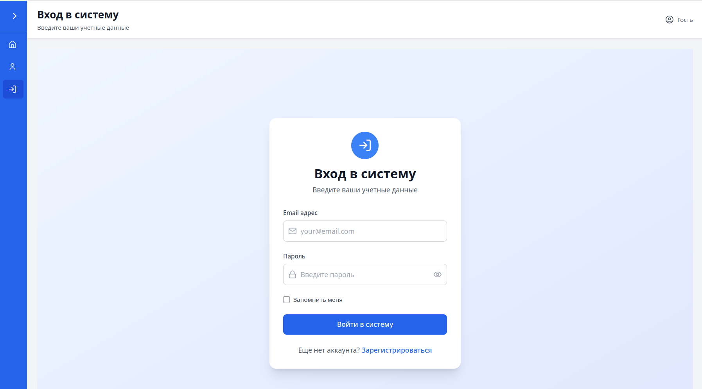
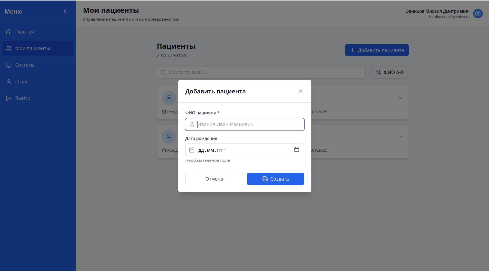
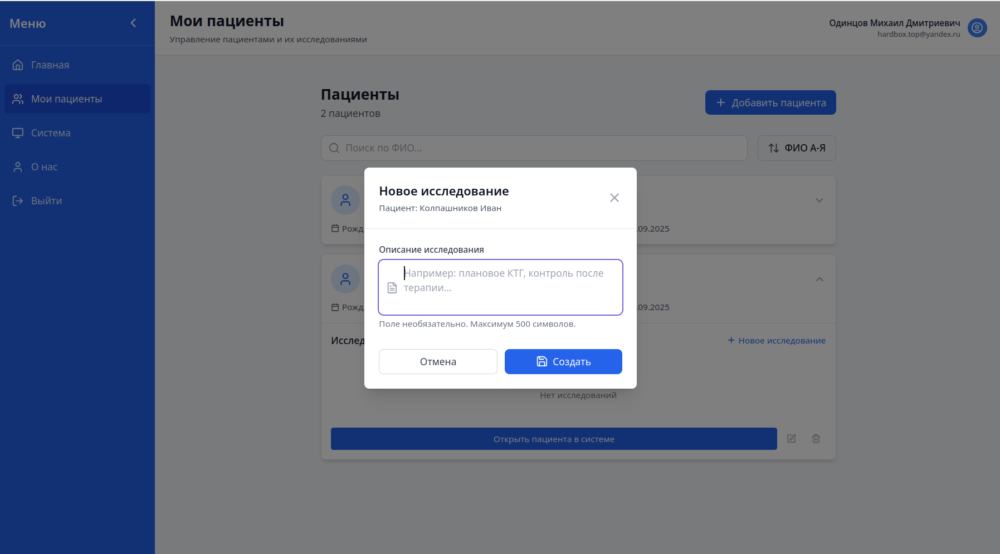
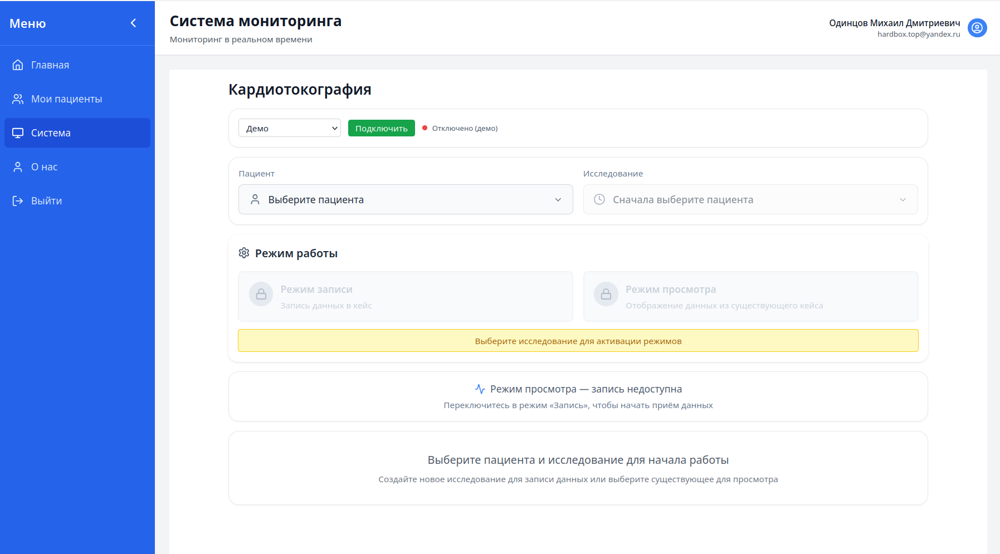

# Руководство пользователя (Deploy & Использование)

## 1) Что понадобится

* **Docker** и **Docker Compose** (актуальные версии).
* Порт(ы), свободные на машине:

  * Prod-профиль: **80/443** (через Nginx) — по желанию.
  * Dev/пилот: фронтенд на **5173**, API за **Nginx** на **90** (можно поменять).
* Интернет для сборки образов (первый раз).

---

## 2) Конфигурация окружения

Создайте файл **`.env`** в корне проекта. Минимальный пример:

```
# nginx
HOST=localhost
NGINX_PORT=90

# frontend
FRONTEND_PORT=5173

# backend
BACKEND_PORT=9000

# db
DB_HOST=postgres
DB_PORT=5432
DB_USER=hardbox
DB_PASS=supersecret
DB_NAME=hardbox

# ML
ML_PORT=8000
ML_URL=http://ml:8000/predict

# sim worker
CSV_PATH=/app/src/demo.csv
```

---

## 3) Запуск

В корне проекта:

```bash
docker compose build          # первый раз/при изменениях
docker compose up -d          # запуск сервисов
```

Проверка готовности:

* Фронтенд (dev-профиль): **[http://localhost:5173/](http://localhost:5173/)**
* Общая точка входа через Nginx (API/фронт): **[http://localhost:90/](http://localhost:90/)**
* Health:

  * **API**: `GET http://localhost:90/api/health`
  * **Nginx** логи: `docker compose logs nginx -f`

---

## 4) Первое знакомство с интерфейсом

Откройте **фронтенд** в браузере.

1. **Авторизация/вход**
   - Войдите под тестовым пользователем или зарегистрируйте нового.
   


2. **Пациенты и кейсы**

   * Создайте **пациента** (минимум: имя/псевдоним).
    
   * Создайте **кейс** для пациента — это контейнер, куда пойдёт поток.
    
3. **Мониторинг в реальном времени**
   Зайдите в **Dashboard** кейса:

   * Верхняя панель статуса: соединение, последняя точка.
   * Графики **FHR (bpm)** и **UC** за **последние 5 минут**.
   * **Кривая вероятности риска** на ближайшие 5 минут и **порог**.
   * Индикатор **тревоги** (гистерезис) — включается/выключается без «мигания».

4. **Демо/симуляция** (если включён `DEMO_MODE`)

   * Нажмите **Start** — пойдёт проигрывание CSV (1 Гц).
   * На графиках появятся данные, кривая риска будет обновляться **каждую секунду**.
   


---

## 5) Как пользоваться

* **Онлайн-поток**: система автоматически принимает точки `t,bpm,uc` (1 Гц), показывает последние 5 минут, и считает прогноз на следующие 5 минут.
* **Порог риска**: на графике видна текущая горизонтальная линия (обычно **0.44–0.5**).
* **Тревога**: включается не сразу по одному всплеску, а устойчиво (гистерезис), чтобы не отвлекать персонал.
* **История**: можно открыть вкладку истории кейса и посмотреть ленту предсказаний/эпизодов за выбранный период.
* **Экспорт**: экран можно сохранить скриншотом для разбора смены (при наличии кнопки «Export»).

---

## 6) FAQ

**Ничего не видно на графиках.**
Проверьте, идёт ли поток (индикатор соединения) и включён ли демо-режим. Для реальных датчиков — корректность отправки данных на `/api/ingest` (или используемый путь).

**Кривая риска «ступенчато» двигается.**
В норме оценка обновляется **каждую секунду** — кривая плавная. Если видите ступени: проблемы сети или слишком редкий фронтовый перерендер; обновите страницу, проверьте задержки.

**Тревога часто «мигает».**
Отрегулируйте порог и гистерезис в настройках. По умолчанию мигания быть не должно.

**Как менять адреса?**
Всё, что с адресами и портами, задаётся через `.env`. После изменения перезапустите контейнеры.

---

## 7) Обновление и остановка

```bash
docker compose up -d   # обновиться до свежих образов
docker compose down                            # остановить все сервисы
docker compose logs -f                         # посмотреть логи
```

---

## 8) Дополнительные материалы

* **Developer Guide** — эндпоинты, форматы, как эмулировать поток: [ссылка](backend/README.md)
* **ML Guide** — как считаются признаки и валидируется модель: [решение](ml/notebooks/solution.ipynb), [документация](ml/README.md)